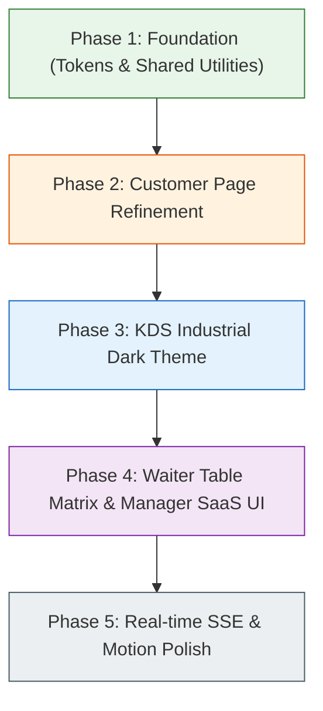

# 🍽️ Dineflow Frontend Design Revamp: Professional UI/UX Architecture & Design System

---

## 1. Executive Summary & Design Vision

Currently, Dineflow has a functional, responsive prototype with a warm color palette (`--paper`, `--charcoal`, `--paprika`, `--herb`). However, the interfaces still feel like an early developer build due to:
- Reliance on system fonts and raw native HTML inputs/buttons across staff panels.
- Inconsistent typographic scales across dashboards.
- Use of unstyled OS emojis (`📱`, `👨‍🍳`, `📊`, `🔔`, `❌`, `✅`) which render inconsistently across Android, iOS, Windows, and Linux.
- Abrupt full-DOM re-renders on poll cycles (causing UI flickering and scroll jumps).
- High visual friction in the Kitchen Display (which requires glanceable, high-contrast, industrial legibility).

### The Vision
Elevate Dineflow to look and feel like an enterprise hospitality platform (comparable to **Toast POS**, **Square for Restaurants**, and **SevenRooms**), featuring:
1. **Bistro Modern Aesthetics**: Refined typography, subtle tactile depth, warm parchment undertones, and crisp micro-interactions.
2. **Glanceable Kitchen Display System (KDS)**: High-contrast dark industrial interface optimized for kitchen glare, timers, and rush hours.
3. **Frictionless Mobile Diner Experience**: App-like mobile web feel with food imagery placeholders, dietary tags (Veg/Non-Veg, Halal, Gluten-Free), floating cart summaries, and live status progress bars.
4. **Enterprise SaaS Back-Office**: Clean tabular data density, metric KPI stat cards, and frictionless menu item toggling.

---

## 2. Universal Design System Foundation

### 2.1 Cohesive Color System & Semantic Tokens

Establish a single, shared CSS variables manifest (`/static/css/tokens.css`) rather than duplicating `:root` values across HTML files:

```css
:root {
  /* Surface & Base */
  --surface-canvas: #F8F5EE;      /* Warm off-white parchment background */
  --surface-card: #FFFFFF;        /* Pure white for elevation cards */
  --surface-subtle: #F1EAD8;      /* Secondary background, table headers */
  --surface-elevated: #FFFFFF;    /* Modals & floating drawers */

  /* Text & Inks */
  --ink-primary: #1C1A17;         /* Deep rich charcoal for high contrast */
  --ink-secondary: #5E5A52;       /* Mid-tone slate for descriptions */
  --ink-muted: #8E8A80;           /* Captions, metadata, session tokens */
  --ink-inverse: #FAF7F0;

  /* Brand Accents */
  --brand-paprika: #C84617;       /* Energetic warm terracotta/paprika */
  --brand-paprika-hover: #A73810;
  --brand-herb: #285934;          /* Fresh sage/rosemary green for success */
  --brand-herb-hover: #1E4427;
  --brand-amber: #D9822B;         /* Golden amber for pending alerts/calls */

  /* Semantic State Colors */
  --state-placed: #D9822B;        /* Pending / Placed in queue */
  --state-accepted: #1976D2;      /* Cooking / In Progress */
  --state-ready: #2E7D32;         /* Ready to plate / Deliver */
  --state-served: #607D8B;        /* Completed */
  --state-rejected: #C62828;      /* Denied / Out of stock */

  /* Borders & Dividers */
  --border-hairline: rgba(33, 31, 28, 0.08);
  --border-card: #E5DEC9;
  --border-focus: #1C1A17;

  /* Elevation Shadows */
  --shadow-sm: 0 1px 3px rgba(33, 31, 28, 0.05), 0 1px 2px rgba(33, 31, 28, 0.08);
  --shadow-md: 0 4px 12px rgba(33, 31, 28, 0.07), 0 2px 4px rgba(33, 31, 28, 0.04);
  --shadow-lg: 0 12px 32px rgba(33, 31, 28, 0.12), 0 4px 8px rgba(33, 31, 28, 0.06);
  --shadow-sheet: 0 -8px 28px rgba(0, 0, 0, 0.15);

  /* Radii */
  --radius-xs: 4px;
  --radius-sm: 8px;
  --radius-md: 12px;
  --radius-lg: 18px;
  --radius-pill: 9999px;

  /* Transitions */
  --motion-fast: 150ms cubic-bezier(0.4, 0, 0.2, 1);
  --motion-bounce: 300ms cubic-bezier(0.34, 1.56, 0.64, 1);
}
```

---

### 2.2 Typography Scale

Use Google Fonts systematically across **all** pages (currently only `customer.html` imports them):
- **Display / Brand**: `Fraunces` (variable optical size font, weights 500 & 600) — delivers high-end culinary warmth.
- **Interface / Reading**: `Plus Jakarta Sans` or `Inter` (weights 400, 500, 600, 700) — clean legibility on small mobile displays.
- **Numbers / Monospace**: `JetBrains Mono` or `IBM Plex Mono` (weights 500 & 600) — tabular numbers that align perfectly in bills and quantity counters.

```css
/* Typography Utility Hierarchy */
.text-display-lg  { font-family: 'Fraunces', serif; font-size: 28px; line-height: 1.2; font-weight: 600; letter-spacing: -0.02em; }
.text-display-md  { font-family: 'Fraunces', serif; font-size: 20px; line-height: 1.3; font-weight: 600; }
.text-title       { font-family: 'Inter', sans-serif; font-size: 16px; line-height: 1.4; font-weight: 600; color: var(--ink-primary); }
.text-body        { font-family: 'Inter', sans-serif; font-size: 14px; line-height: 1.5; color: var(--ink-secondary); }
.text-caption     { font-family: 'Inter', sans-serif; font-size: 12px; line-height: 1.4; color: var(--ink-muted); }
.text-tabular     { font-family: 'IBM Plex Mono', monospace; font-variant-numeric: tabular-nums; }
```

---

### 2.3 Iconography: Replace Raw Emojis with Vector SVGs

Emojis render wildly differently across platforms (e.g. Windows flat emoji vs. iOS 3D glossy vs. Android blob). Use a unified SVG icon set like **Lucide Icons** (lightweight CDN or inline SVG sprites):

| Current Emoji | Recommended Lucide Icon | Purpose |
|---|---|---|
| 📱 Customer | `<i data-lucide="smartphone"></i>` | Landing page card |
| 👨‍🍳 Kitchen | `<i data-lucide="flame"></i>` or `<i data-lucide="chef-hat"></i>` | Kitchen module |
| 🧑‍🍳 Waiter | `<i data-lucide="concierge-bell"></i>` | Service operations |
| 📊 Manager | `<i data-lucide="layout-dashboard"></i>` | Analytics & menu management |
| 🔔 Call | `<i data-lucide="bell-ring"></i>` | Waiter call notification |
| 🧾 Order | `<i data-lucide="receipt"></i>` | Bill summary |
| 📷 Scan | `<i data-lucide="scan-line"></i>` | Camera scanner |
| ❌ / ✅ | `<i data-lucide="x"></i>` / `<i data-lucide="check"></i>` | Actions and status |

---

## 3. Screen-by-Screen UI/UX Redesign Blueprint

### 3.1 Customer Mobile Experience (`customer.html`)

The customer interface is the primary guest touchpoint. It needs to feel as refined as an upscale dining room menu.

#### Recommended UI Enhancements:
1. **Hero Header & Table Pill**:
   - Replace the zig-zag CSS sawtooth bottom with a clean, frosted glass sticky header (`backdrop-filter: blur(12px)`).
   - Display a stylish status chip: `● Table 4` with live waiter availability and quick session badge.
2. **Dietary Markers & Menu Cards**:
   - Add Indian culinary standards:
     - 🟢 **Veg** indicator: Green bordered square with solid green circle inside.
     - 🔴 **Non-Veg** indicator: Brown/Red bordered square with solid triangle inside.
     - 🌶️ **Spiciness meter** (1 to 3 chillies).
     - ⭐️ **Chef's Special** pill tag.
   - Menu card layout: Two-column layout with dish details on the left, price + photo placeholder / add-stepper pill on the right.
3. **Interactive Stepper Button**:
   - Instead of separate `+`, `-`, and `Add` buttons taking up vertical space:
     - Initial state: Sleek `[+ Add]` pill button.
     - Once tapped: Seamlessly expands into `[ −  1  + ]` with spring animation.
4. **Order Status Timeline**:
   - Replace simple status text badges with a 4-step progress line:
     `[ 1. Received ] ─── [ 2. In Kitchen ] ─── [ 3. Plating ] ─── [ 4. Served ]`
   - Real-time pulse animation on the active phase.
5. **Smart Floating Bottom Bar**:
   - An elegant floating pill docked at the bottom with:
     - Total items count badge.
     - Running price in tabular monospace font.
     - Call-to-action button: `Review Order →`.

---

### 3.2 Kitchen Display System (`kitchen.html`)

Kitchen environments are hot, steamy, chaotic, and view-distance dependent. The white/cream theme causes glare under industrial lighting.

#### Recommended UI Enhancements:
1. **Dark Industrial KDS Theme**:
   - Canvas background: `#121214` (Deep matte black).
   - Card background: `#1E1E24` with high-contrast `#FFFFFF` typography.
2. **Urgency-Based Color Coding (Elapsed Timers)**:
   - Calculate minutes since order placement:
     - **0 – 7 mins (Normal)**: Calm green header badge (`04:12`).
     - **8 – 14 mins (Warning)**: Amber header badge (`11:45`).
     - **15+ mins (Critical Rush)**: Flashing crimson border + pulse badge (`18:30`).
3. **Item Strike-Through / Modifier Checklist**:
   - Let kitchen staff tap individual order line items to mark them plated (`line-through` and 50% opacity), before hitting the master "Mark Ready" button.
4. **Sound Alerts (Audio Notification)**:
   - Subtle acoustic chime (using Web Audio API synthesized tone, zero external mp3 file needed) whenever a new order enters the queue.

---

### 3.3 Waiter Panel (`waiter.html`)

Waiters hold handheld devices while moving between tables; they need high-speed, one-handed touch ergonomics.

#### Recommended UI Enhancements:
1. **Interactive Table Status Matrix**:
   - Replace the static text table with a visual card grid representing floor tables:
     - 🟩 **Green**: Dining normally / orders in progress.
     - 🟨 **Yellow**: 25+ min idle check-in alert.
     - 🟥 **Red**: Bill requested / Cash payment collection needed.
     - 🟦 **Blue**: Active waiter bell call.
2. **Sticky Priority Feed**:
   - Separate tabs: `[ Alerts (3) ] | [ Food Ready (2) ] | [ All Tables ]`.
   - Big, tactile action buttons (minimum 48px touch target height to prevent mis-clicks).
3. **Fast Counter Search Bar**:
   - Large numeric search bar with auto-formatting for 10-digit mobile numbers (`(XXX) XXX-XXXX`) with instant debounced lookup.

---

### 3.4 Manager Dashboard (`manager.html`)

The manager dashboard should feel like a contemporary SaaS portal (e.g. Stripe, Linear, Vercel).

#### Recommended UI Enhancements:
1. **Top KPI Metric Cards**:
   - Include 4 overview cards above tabs:
     - **Active Tables**: `5 / 12 occupied`
     - **Today's Revenue**: `₹18,450`
     - **Average Prep Time**: `14 min`
     - **Pending Disputes / Overrides**: `0`
2. **Modern Menu Management Table**:
   - iOS-style animated slide toggle for "86 / Available" instead of a raw text button.
   - Quick search filter to instantly find dishes by name or category.
   - Price inline-editing capability.
3. **QR Code Sheet Printable Layout**:
   - Clean `@media print` CSS template with dedicated branded tent-card borders, so printing produces ready-to-fold table stands.

---

## 4. Frontend Code Architecture Revamp

To make the codebase maintainable without introducing heavy JavaScript frameworks (React/Vue), adopt a modular Vanilla structure:

```
src/main/resources/static/
│
├── css/
│   ├── tokens.css           # Color palette, spacing, typography scales
│   ├── base.css             # Reset, typography, utility classes
│   ├── components.css       # Buttons, cards, badges, steppers, modals
│   ├── customer.css         # Customer view specifics
│   ├── kds.css              # Kitchen Dark Mode styling
│   └── dashboard.css        # Waiter & Manager shared table/layout styles
│
├── js/
│   ├── core/
│   │   ├── api.js           # Unified fetch wrapper with error handling & CSRF
│   │   ├── formatters.js    # Currency (Intl.NumberFormat), time elapsed, phone
│   │   └── toast.js         # Unified accessible toast/notification system
│   ├── pages/
│   │   ├── customer.js
│   │   ├── kitchen.js
│   │   ├── waiter.js
│   │   └── manager.js
│   └── icons.js             # SVG icon injector (or Lucide standalone)
│
├── index.html
├── customer.html
├── kitchen.html
├── waiter.html
└── manager.html
```

---

## 5. Security & Accessibility (a11y) Upgrades

### 5.1 Safe DOM Rendering (Eliminating XSS)
Replace raw `innerHTML` string concatenations with safe sanitization or template construction:

```javascript
// Helper for XSS-safe text rendering
function escapeHtml(str) {
  if (!str) return '';
  const div = document.createElement('div');
  div.textContent = str;
  return div.innerHTML;
}
```

### 5.2 Accessibility Checklist
1. **Modal Focus Trapping**: Prevent keyboard tab cycles from navigating behind active modals (`#phone-overlay`, `#pay-timing-overlay`).
2. **ARIA Roles**:
   - Modals: `role="dialog" aria-modal="true" aria-labelledby="modal-title"`.
   - Order alerts: `role="alert" aria-live="polite"`.
   - Tabs: `role="tablist"`, `role="tab"`, `role="tabpanel"`.
3. **Escape Key Handling**: Add global listeners:
   ```javascript
   window.addEventListener('keydown', (e) => {
     if (e.key === 'Escape') closeModal();
   });
   ```

---

## 6. Real-Time Architecture Upgrade: Polling to SSE

Currently, polling happens via `setInterval(..., 4000)`. This causes battery drain and server overhead.
A lightweight upgrade is **Server-Sent Events (SSE)**, supported natively by both Spring Boot (`SseEmitter`) and standard browser JavaScript (`EventSource`):

```javascript
// Zero client libraries needed
const eventSource = new EventSource('/api/public/sessions/' + state.sessionToken + '/stream');

eventSource.addEventListener('order-updated', (event) => {
  const order = JSON.parse(event.data);
  updateOrderStatusSmoothly(order);
});

eventSource.addEventListener('bill-updated', (event) => {
  const bill = JSON.parse(event.data);
  updateBillSummary(bill);
});
```

---

## 7. Recommended Implementation Sequence



1. **Phase 1: Design Tokens & Base CSS**: Extract shared variables, reset styles, and button/badge classes into standalone `.css` files.
2. **Phase 2: Customer Experience**: Add veg/non-veg tags, interactive stepper pills, visual dietary tags, and the sticky cart bar.
3. **Phase 3: KDS Dark Mode**: Convert `kitchen.html` into a matte black industrial display with elapsed timer color thresholds.
4. **Phase 4: Staff Operations**: Modernize the Waiter table overview into visual table cards and give the Manager dashboard modern KPI cards.
5. **Phase 5: Polish & Accessibility**: Add smooth transitions, keyboard shortcuts, and replace interval polling with Server-Sent Events.
